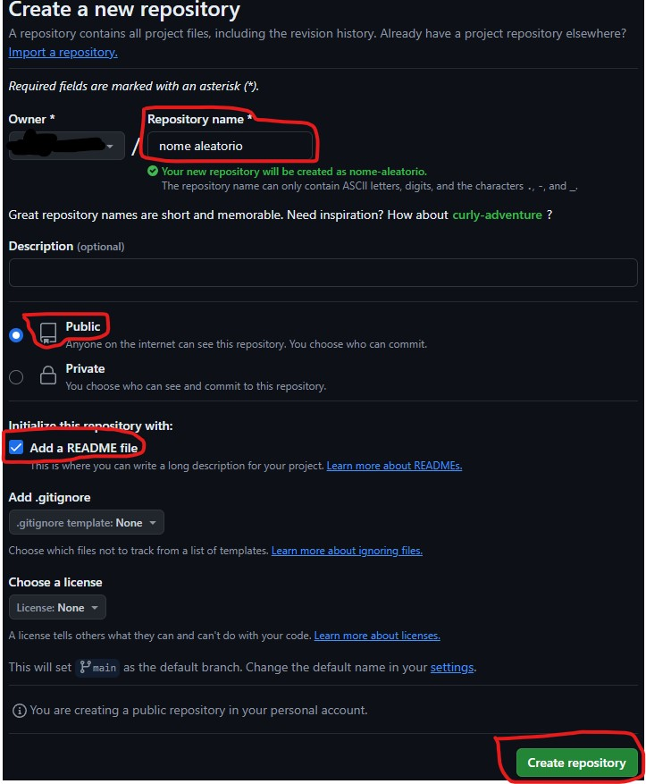
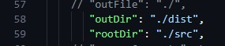
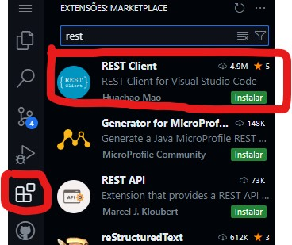
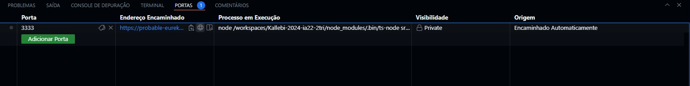
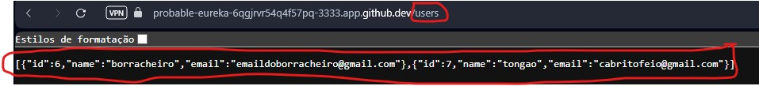
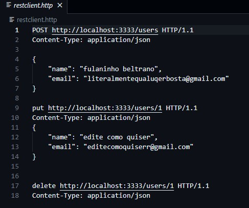
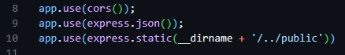
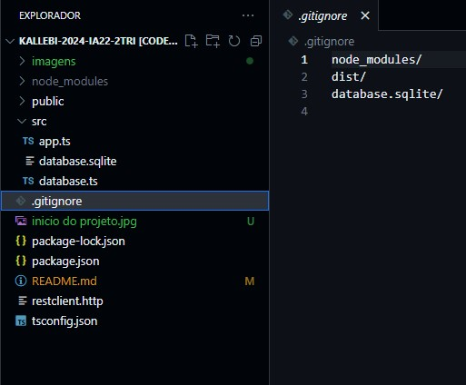
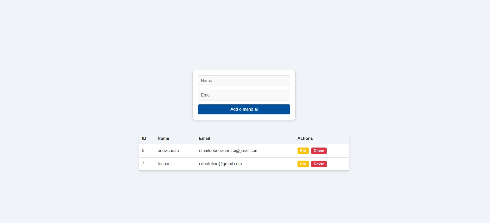

# Kallebi-2024-ia22-2tri

## Tutorial do Projeto de Gerenciamento de Usuários

### 1. Configurando o Repositório e Ambiente
Criar Repositório no GitHub:
Acesse o GitHub e crie um novo repositório.
Certifique-se de incluir um arquivo README.md ao criar o repositório.
Depois de criar, vá até o botão Code, selecione Codespaces e clique em Create Codespace on main.


 

#

### 2. Iniciando o Projeto
Abra o terminal do Codespace e insira os seguintes comandos um a um:

```bash 

npm init -y
npm install express cors sqlite3 sqlite
npm install --save-dev typescript nodemon ts-node @types/express @types/cors
npx tsc --init
mkdir src
touch src/app.ts
```
## *Uma explicação simples dos comandos* 
(pode pular essa parte se quiser)

### npm init -y:

Esse comando cria um arquivo chamado package.json, que é como o "cartão de identidade" do seu projeto. Ele guarda informações importantes, como o nome, a versão e as dependências (os pacotes que o projeto precisa). O -y pula as perguntas e cria o arquivo com configurações padrão.

### npm install express cors sqlite3 sqlite:

Esse comando instala pacotes que você vai usar no seu projeto:
Express: Uma ferramenta que ajuda a criar servidores web.
Cors: Um pacote para lidar com a segurança e permitir que seu servidor seja acessado de outros sites.
Sqlite3 e sqlite: Pacotes para trabalhar com um banco de dados leve e fácil de usar, chamado SQLite.

### npm install --save-dev typescript nodemon ts-node @types/express @types/cors:

Aqui, você está instalando pacotes que ajudam no desenvolvimento do projeto:
TypeScript: Uma linguagem que é parecida com o JavaScript.
Nodemon: Um programa que fica de olho no seu código e reinicia o servidor automaticamente sempre que você fizer uma mudança.
Ts-node: Uma ferramenta que permite rodar arquivos TypeScript diretamente, sem precisar convertê-los para JavaScript primeiro.
@types/express e @types/cors: Pacotes que ajudam o TypeScript a entender como usar o Express e o Cors.

### npx tsc --init:

Esse comando cria um arquivo chamado tsconfig.json. Ele diz ao TypeScript como deve funcionar no seu projeto, como onde colocar os arquivos convertidos e como tratar os erros.

### mkdir src:

Esse comando cria uma nova pasta chamada src. É aqui que você vai guardar o código principal do seu projeto.

### touch src/app.ts:

Esse comando cria um novo arquivo dentro da pasta src chamado app.ts. É aqui que você vai começar a escrever o código do seu servidor.
 
## 3. Configurando o TypeScript

Abra o arquivo `tsconfig.json` e localize a linha 58 com //"outDir": "./". Altere para: "outDir": "./dist",
e na linha abaixo cole "rootDir": "./src", como a imagem abaixo



## 4. Configurando o package.json
Abra o arquivo package.json para alterar a linha 6 que estiver escrito "Script": 

estará escrito ` "test": "echo \"Error: no test specified\" && exit 1" ` você deverá adicionar uma `,` no final da linha, e adicionar o seguinte código na proxima linha : 

"dev": "npx nodemon src/app.ts"
}

##### Esse script permite iniciar o servidor em modo de desenvolvimento, com recarregamento automático.

## 5. Criando o Servidor Inicial
No arquivo src/app.ts, adicione o seguinte código para configurar o servidor básico:
```
typescript
Copiar código
import express from 'express';
import cors from 'cors';

const port = 3333;
const app = express();

app.use(cors());
app.use(express.json());

app.get('/', (req, res) => {
  res.send('Hello World');
});

app.listen(port, () => {
  console.log(`Server running on port ${port}`);
});
express(): Inicializa o aplicativo Express.
cors(): Habilita o suporte para CORS.
express.json(): Permite que o Express entenda o JSON enviado nas requisições.
```

## 6. Iniciando o Servidor
Instale a biblioteca REST Client:
Pesquise por REST Client na aba de extensões e instale.



## assim que instalado, abra o terminal (ctrl + ' ) e execute o comando:
`npm run dev`

assim que executar o comando no canto inferior direito, selecione Abrir no navegador. Se tudo estiver correto, você verá a mensagem "Hello World".

caso tenha fechado aba basta abri o terminal (ctrl + ') ir ate "portas" e clicar no botão que é um globo (quando você passar o mouser vai estar escrito "abrir no navegador")




## 7. Configurando o Banco de Dados
Crie o arquivo `database.ts` na pasta `src` e adicione o código:
```
typescript
Copiar código
import { Database, open } from 'sqlite';
import sqlite3 from 'sqlite3';

let instance: Database | null = null;

export async function connect() {
  if (instance) return instance;

  const db = await open({
    filename: './src/database.sqlite',
    driver: sqlite3.Database
  });

  await db.exec(`
    CREATE TABLE IF NOT EXISTS users (
      id INTEGER PRIMARY KEY AUTOINCREMENT,
      name TEXT,
      email TEXT
    )
  `);

  instance = db;
  return db;
}
```

## 8. Integrando o Banco de Dados com o Servidor
No arquivo da pasta src vá até o arquivo `app.ts` e apague todo o código do arquivo para o substituir por esse:
```
typescript
Copiar código
import express from 'express';
import cors from 'cors';
import { connect } from './database';

const port = 3333;
const app = express();

app.use(cors());
app.use(express.json());

app.get('/', (req, res) => {
  res.send('Hello World');
});

app.post('/users', async (req, res) => {
  const db = await connect();
  const { name, email } = req.body;

  const result = await db.run('INSERT INTO users (name, email) VALUES (?, ?)', [name, email]);
  const user = await db.get('SELECT * FROM users WHERE id = ?', [result.lastID]);

  res.json(user);
});

app.get('/users', async (req, res) => {
  const db = await connect();
  const users = await db.all('SELECT * FROM users');

  res.json(users);
});

app.put('/users/:id', async (req, res) => {
  try {
    const db = await connect();
    const { name, email } = req.body;
    const { id } = req.params;
    if (!name || !email) {
      return res.status(400).json({ error: 'Name and email are required' });
    }
    const result = await db.run('UPDATE users SET name = ?, email = ? WHERE id = ?', [name, email, id]);
    if (result.changes === 0) {
      return res.status(404).json({ error: 'User not found' });
    }
    const user = await db.get('SELECT * FROM users WHERE id = ?', [id]);
    res.json(user);
  } catch (error) {
    res.status(500).json({ error: 'Internal server error' });
  }
});

app.delete('/users/:id', async (req, res) => {
  try {
    const db = await connect();
    const { id } = req.params;
    const result = await db.run('DELETE FROM users WHERE id = ?', [id]);
    if (result.changes === 0) {
      return res.status(404).json({ error: 'User not found' });
    }
  } catch (error) {
    res.status(500).json({ error: 'Internal server error' });
  }
});

app.listen(port, () => {
  console.log(`Server running on port ${port}`);
});
```

## 9. Testando 
Crie um arquivo `restclient.http` na pasta src com o seguinte conteúdo:

```
POST http://localhost:3333/users HTTP/1.1
Content-Type: application/json

{
  "name": "tongao esperto",
  "email": "tongodasilva@gmail.com"
}
```
## 10. listando o usuário:
vá até a pasta src no arquivo `app.ts` e insira a rota `/users` ao servidor colando o codigo abaixo.

```
app.get('/users', async (req, res) => {
  const db = await connect();
  const users = await db.all('SELECT * FROM users');

  res.json(users);
});
```
## 11 PUT e Delete usuários

agora vamos criar as rotas para alterar e deletar usuários.
vá até a pasta src no arquivo `app.ts` e insira o seguinte código logo abaixo de app.post:
```
app.put('/users/:id', async (req, res) => {
    try {
        const db = await connect();
        const { name, email } = req.body;
        const { id } = req.params;
        if (!name || !email) {
            return res.status(400).json({ error: 'Name and email are required' });
        }
        const result = await db.run('UPDATE users SET name = ?, email = ? WHERE id = ?', [name, email, id]);
        if (result.changes === 0) {
            return res.status(404).json({ error: 'User not found' });
        }
        const user = await db.get('SELECT * FROM users WHERE id = ?', [id]);
        res.json(user);
    } catch (error) {
        res.status(500).json({ error: 'Internal server error' });
    }
});
```
logo abaixo do código anterior, vamos deletar os usuários com seguinte codigo:
```
app.delete('/users/:id', async (req, res) => {
    try {
        const db = await connect();
        const { id } = req.params;
        const result = await db.run('DELETE FROM users WHERE id = ?', [id]);
        if (result.changes === 0) {
            return res.status(404).json({ error: 'User not found' });
        }
    } catch (error) {
    }
});
```
## 12 testando o que fizemos.
se tudo ocorrer certo, você será capaz de postar,editar e deletar os usuários.

abra seu arquivo restclient.http

 para entender se você fez tudo certo, precisamos testar se o seu usuario está sendo inserido como deveria. primeiro, aperte o botão `Send Request` logo em cima de `POST` 

 Agora, voltamos para o navegador e ao final da requisição https iremos adicionar `/users` e apertar enter:

 

 para adicionar o método PUT ao código, basta colar esse código logo abaixo do método POST no restclient.http

 ```
 put http://localhost:3333/users/1 HTTP/1.1
Content-Type: application/json
{
    "name": "edite como quiser",
    "email": "editecomoquiserr@gmail.com"
}
 ``` 

para adicionar o método DELETE ao código, basta fazer o mesmo e colar esse código abaixo do anterior.
```
delete http://localhost:3333/users/1 HTTP/1.1
Content-Type: application/json
```
e ficará assim:



### Agora que testamos a inserção e manipulação de dados, com toda a base pronta, só falta fazer a parte visual do site para deixá-lo mais atraente e fácil de usar.


## 13. Configurando a Parte Visual do Site
### Crie a pasta chamada `public`. Dentro da pasta public, crie o arquivo `index.html` e adicione o seguinte código:
```
<!DOCTYPE html>
<html lang="en">
<head>
  <meta charset="UTF-8">
  <meta name="viewport" content="width=device-width, initial-scale=1.0">
  <title>to sem criatividade</title>
  <style>
    body {
      font-family: 'Arial', sans-serif;
      background-color: #f0f4f8;
      color: #333;
      margin: 0;
      padding: 0;
      display: flex;
      flex-direction: column;
      align-items: center;
      justify-content: center;
      height: 100vh;
    }

    form {
      background-color: #ffffff;
      border: 1px solid #d1d1d1;
      padding: 20px;
      border-radius: 10px;
      box-shadow: 0 4px 8px rgba(0, 0, 0, 0.1);
      width: 350px;
      display: flex;
      flex-direction: column;
      gap: 15px;
      margin-bottom: 30px;
    }

    input[type="text"], input[type="email"] {
      padding: 10px;
      border: 1px solid #d1d1d1;
      border-radius: 5px;
      font-size: 16px;
      background-color: #f9f9f9;
    }

    button[type="submit"] {
      background-color: #00509e;
      color: white;
      border: none;
      padding: 10px;
      border-radius: 5px;
      cursor: pointer;
      font-size: 16px;
      transition: background-color 0.3s ease;
    }

    button[type="submit"]:hover {
      background-color: #003f7f;
    }

    table {
      width: 100%;
      max-width: 800px;
      border-collapse: collapse;
      margin-top: 20px;
      background-color: white;
      border-radius: 10px;
      box-shadow: 0 4px 8px rgba(0, 0, 0, 0.1);
    }

    th, td {
      padding: 12px;
      text-align: left;
      border-bottom: 1px solid #d1d1d1;
    }

    th {
      background-color: #f1f5f9;
      font-weight: bold;
    }

    tbody tr:hover {
      background-color: #f1f5f9;
    }

    .action-buttons button {
      margin-right: 5px;
      padding: 5px 10px;
      border: none;
      border-radius: 5px;
      cursor: pointer;
    }

    .edit {
      background-color: #ffc107;
      color: white;
    }

    .delete {
      background-color: #dc3545;
      color: white;
    }

    .edit:hover {
      background-color: #e0a800;
    }

    .delete:hover {
      background-color: #c82333;
    }
  </style>
</head>
<body>

  <form>
    <input type="text" name="name" placeholder="Name" required>
    <input type="email" name="email" placeholder="Email" required>
    <button type="submit">Add o mano ai</button>
  </form>

  <table>
    <thead>
      <tr>
        <th>ID</th>
        <th>Name</th>
        <th>Email</th>
        <th>Actions</th>
      </tr>
    </thead>
    <tbody>
     
    </tbody>
  </table>

  <script>
    const form = document.querySelector('form');
    const tbody = document.querySelector('tbody');

    form.addEventListener('submit', async (event) => {
      event.preventDefault();
      const name = form.name.value.trim();
      const email = form.email.value.trim();

      await fetch('/users', {
        method: 'POST',
        headers: { 'Content-Type': 'application/json' },
        body: JSON.stringify({ name, email })
      });

      form.reset();
      loadUsers();
    });

    async function loadUsers() {
      const response = await fetch('/users');
      const users = await response.json();

      tbody.innerHTML = '';
      users.forEach(user => {
        const row = document.createElement('tr');
        row.innerHTML = `
          <td>${user.id}</td>
          <td>${user.name}</td>
          <td>${user.email}</td>
          <td class="action-buttons">
            <button class="edit">Edit</button>
            <button class="delete">Delete</button>
          </td>
        `;

        const deleteButton = row.querySelector('.delete');
        const editButton = row.querySelector('.edit');

        deleteButton.addEventListener('click', async () => {
          await fetch(`/users/${user.id}`, { method: 'DELETE' });
          loadUsers();
        });

        editButton.addEventListener('click', () => {
          const newName = prompt('muda o nome cara:', user.name);
          const newEmail = prompt('inventa outro email:', user.email);

          if (newName && newEmail) {
            fetch(`/users/${user.id}`, {
              method: 'PUT',
              headers: { 'Content-Type': 'application/json' },
              body: JSON.stringify({ name: newName, email: newEmail })
            }).then(loadUsers);
          }
        });

        tbody.appendChild(row);
      });
    }

    loadUsers();
  </script>
</body>
</html>
```

## 14 agora precisamos adicionar a seguinte linha ao arquivo app.ts depois da linha 9  
```
app.use(express.static(__dirname + '/../public'))
```
e ficará assim:



agora é só testar. se o seu servidor tiver fechado com o tempo, basta colar o comando `npm run dev` no terminal e executar.

agora crie o arquivo .gitignore e cole isso:
```
node_modules/
dist/
database.sqlite/
```


## veja como ficou por fim nosso tutorial abrindo no navegador e é noiss

